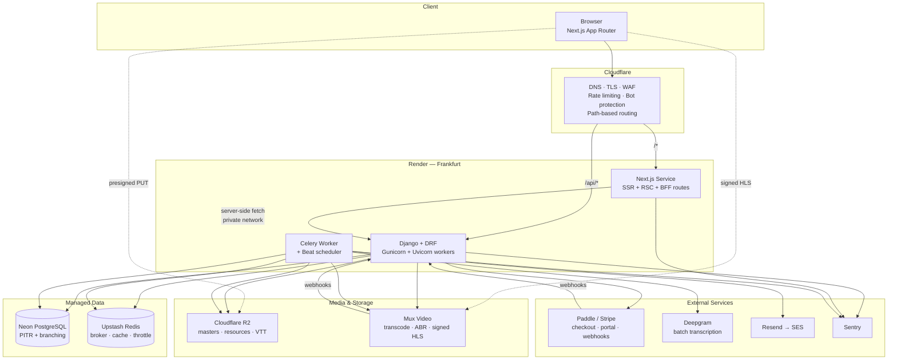
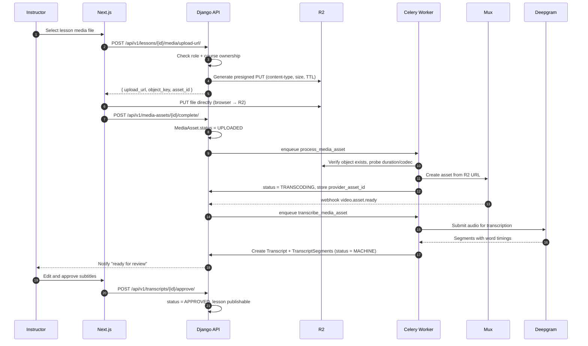
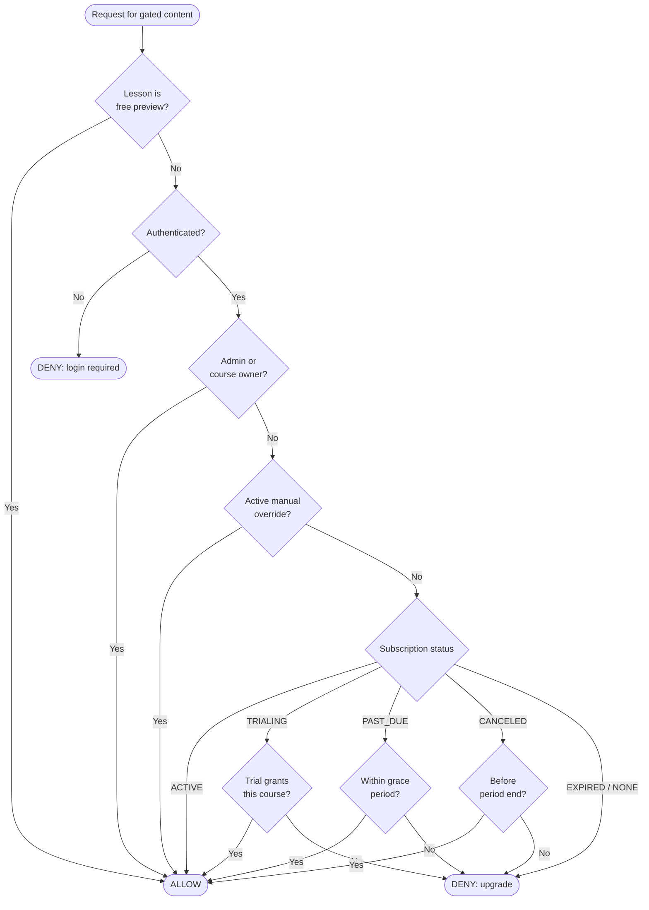

# Phase 1 — Architecture & Technical Roadmap

**Project:** Curated language-learning subscription platform
**Stack:** Django + Django REST Framework · Next.js (App Router) + TypeScript + Tailwind · PostgreSQL
**Status:** Architecture proposal, pending approval. No production code yet.
**Companion document:** `deployment-strategy.md` (infrastructure research and provider selection)

---

## 0. How to read this document

This is a design document, not a tutorial. It exists so that when we start writing code, every structural decision has already been argued and you can disagree with it *now*, cheaply, rather than in month three when it's load-bearing.

Where I've made a judgement call I've written **why**, and where a reasonable engineer would choose differently I've said so. Sections marked **⚠️ Decision required** need your input before implementation starts.

---

# 1. Executive Summary

We're building a subscription language-learning platform as a **Django REST API + Next.js frontend**, deployed as three services (web, API, worker) in a single region, with video, transcription, email and payments delegated to managed providers.

The architecture optimises for three things, in this order:

1. **Entitlement correctness.** Everything in this product is gated by subscription state. A bug here doesn't degrade the experience — it either gives away the product or locks out paying customers. This is the highest-risk surface in the system and it drives the schema, the API design and the milestone ordering.
2. **Migratability of the expensive parts.** Video is 60–85% of infrastructure cost. The data model keeps video provider-agnostic so that decision stays reversible.
3. **Boring, well-trodden technology.** No Kubernetes, no microservices, no event sourcing, no GraphQL. A modular monolith with a background worker will carry this platform well past 10,000 users.

**What I'm deliberately *not* building at MVP:** dedicated search infrastructure, DRM, a data warehouse, real-time features, native apps, instructor payouts, a design system library. Each is a real cost with no MVP payoff.

**Estimated timeline:** 14 milestones. At a realistic solo pace of 10–15 focused hours/week, expect 5–7 months to production launch. I'll give per-milestone complexity ratings rather than false-precision hour estimates.

---

# 2. Technical Explanation — the architectural reasoning

## 2.1 Why a modular monolith, not services

You asked for something "capable of supporting thousands of users." Thousands of users is not a lot. Your Scenario 3 projection (10,000 registered, ~2,000 daily active) works out to roughly 2,000 requests/minute at peak — comfortably one Django process with a few Gunicorn workers.

Splitting into services before you have a scaling problem buys you distributed transactions, network failure modes between your own components, and N deployment pipelines. It costs you the ability to write `select_related()` across your domain. **Modular monolith: one deployable, strict internal app boundaries, no cross-app model imports except through explicit service layers.** If a boundary ever needs to become a network call, the seam is already there.

## 2.2 Why the worker is a separate service from day one

This is the one split I insist on. Your transcription pipeline submits media to an external API, polls for completion, and retries on failure. If that runs in the same process as your web requests:

- A slow transcription job occupies a Gunicorn worker that should be serving a checkout webhook.
- A deploy that restarts the web service kills in-flight jobs.
- You cannot scale request-handling and job-processing independently, and they have completely different load profiles.

Cost of the split: $7/month and one extra service in CI. Cost of not splitting: a class of production incidents that are miserable to diagnose.

## 2.3 The one significant tension in this stack

Django and Next.js both want to be the thing that renders your pages and owns your session. You have to pick.

**Django is the backend. Next.js is the frontend. The API is the contract.** Django never renders a user-facing template (except Django Admin, which is internal). Next.js never talks to PostgreSQL. This sounds obvious and it is routinely violated — the moment you add a Prisma client to Next.js "just for this one query", you have two sources of truth for your schema and two places where entitlement can be checked incorrectly.

The cost of this discipline is the cross-origin auth problem, solved in §7.

---

# 3. High-Level Architecture

## 3.1 System diagram



Two things to notice, because they're the whole point of the diagram:

- **Media never traverses your infrastructure.** The browser uploads directly to R2 with a presigned URL and streams video directly from Mux's CDN with a signed token. Your Django process handles kilobytes of JSON, never gigabytes of video. This is what keeps a $7 service viable.
- **The worker touches everything the API touches.** It shares the database, the models, the settings. It is the same Django codebase running a different entrypoint — not a separate application.

## 3.2 Frontend architecture

| Concern | Decision | Reasoning |
|---|---|---|
| Rendering | **Server Components by default**, Client Components only where interactivity demands it | Catalogue and course pages are SEO-relevant and mostly static per user. The player and the subtitle editor are genuinely interactive |
| Data fetching | Server Components fetch from Django directly over the private network; client mutations go through Next.js Route Handlers (BFF) | Server-side fetch never exposes the API to the browser and adds no client JS |
| State | React Server Components + URL state for filters; **TanStack Query only inside the player and admin editors** | Most of this app doesn't need a client cache. Adding one everywhere is the most common Next.js over-engineering |
| Forms | Server Actions for simple mutations; Route Handlers where you need fine-grained error shapes | Server Actions are excellent for progressive enhancement, awkward for validation-heavy multi-field forms |
| Styling | Tailwind, with a small `components/ui` primitives layer | Do **not** install a full component library on day one. Build the six primitives you actually use |
| Video player | Mux Player (React) wrapped in your own component | Wrapping means swapping video providers touches one file |
| Types | Types generated from DRF's OpenAPI schema, never hand-written | Hand-maintained API types drift silently. `drf-spectacular` → `openapi-typescript` in CI |

**The BFF pattern, explicitly:** the browser talks only to your Next.js origin. Next.js talks to Django. This gives you same-origin cookies (no CORS), a place to hide API details, and the ability to compose multiple API calls into one page render. The cost is one extra network hop on client-initiated mutations — irrelevant at this scale, since both services sit in the same datacentre.

## 3.3 Backend architecture

```
Django project
├── config/              settings, URLs, ASGI/WSGI, Celery app
├── apps/
│   ├── accounts/        User, profiles, roles
│   ├── catalog/         Language, Course, Section, Lesson
│   ├── media_assets/    MediaAsset, upload orchestration, provider adapters
│   ├── transcripts/     Transcript, Segment, review workflow
│   ├── learning/        Enrollment, LessonProgress, resume logic
│   ├── billing/         Plan, Subscription, WebhookEvent, provider adapters
│   ├── entitlements/    Access resolution — the crown jewels
│   ├── notifications/   Email templates and dispatch
│   └── core/            Base models, permissions, pagination, exceptions, audit
└── manage.py
```

**Layering inside each app:**

```
models.py       ── data + invariants only. No business logic that spans models.
selectors.py    ── read queries. Returns querysets/DTOs. No writes.
services.py     ── writes and business operations. Transactional. Where the logic lives.
serializers.py  ── I/O shape only. Validation of *format*, not of *business rules*.
views.py        ── HTTP concerns: auth, permissions, status codes. Thin.
tasks.py        ── Celery tasks. Thin wrappers that call services.
admin.py        ── Django Admin config.
```

**Why this layering matters:** the standard DRF failure mode is business logic in serializers. A serializer runs in an HTTP context, which means the same operation is unavailable to a Celery task, a management command, or a test — and you end up with two implementations of "activate a subscription" that drift. Services are callable from anywhere.

**The rule I'll hold you to in code review:** a view function should be readable in ten seconds. If it contains an `if` statement about business state, that belongs in a service.

## 3.4 Data architecture

- **PostgreSQL is the single source of truth**, including for entitlement. Payment providers are an *event feed into* your database, never a thing you query at request time.
- **Redis is disposable.** Cache, throttle counters, Celery broker. If it vanishes, the app must still be correct — just slower. Never store the only copy of anything there.
- **R2 holds every media master you own.** Mux holds a *derived copy*. This is what makes video migratable.

## 3.5 Media handling flow



**Why the upload goes browser → R2 directly:** a 2 GB lesson video uploaded through Django would occupy a Gunicorn worker for minutes, consume platform egress on the way back out, and fail on any request-size limit. Presigned uploads make file size irrelevant to your compute tier.

**Why R2 first, then Mux:** you own the master. If Mux becomes expensive at Scenario 3 (~$806/month), migrating to Bunny is a re-upload script reading from R2 — not an email to every instructor asking for their source files.

## 3.6 Deployment architecture

| Service | Runs | Instance | MVP cost |
|---|---|---|---:|
| `web` | Next.js production server | Render Starter | $7 |
| `api` | Gunicorn + Uvicorn workers, Django ASGI | Render Starter | $7 |
| `worker` | `celery worker --beat` (single replica) | Render Starter | $7 |
| `postgres` | Neon, EU region | Launch, ~0.25 CU | ~$15 |
| `redis` | Upstash, EU region | Free tier | $0 |

**⚠️ Revision to `deployment-strategy.md`:** that document assumed a single full-stack application. The Django + Next.js split adds two services. **Revised MVP total: ~$83/month** (was ~$62). Scenario 2 ≈ ~$340; Scenario 3 ≈ ~$520 with video on per-GB pricing. Everything else in that document — provider selection, video analysis, migration triggers, security posture — stands unchanged.

**⚠️ Decision required:** `celery worker --beat` in one process is correct at one replica and *dangerous* at two — you get duplicate scheduled executions. Two options: (a) keep beat in the worker and never scale past one replica without splitting it out, (b) use Render Cron Jobs for scheduled work and run only a plain worker. I recommend **(a) with a comment in the service definition**, because Celery Beat with `django-celery-beat` gives you a database-backed schedule you can inspect and modify from Django Admin, which matters for trial-expiry and dunning sweeps.

## 3.7 Monitoring, logging, backups

| Concern | Tool | What specifically |
|---|---|---|
| Errors | Sentry (free → Team) | Django, Celery and Next.js under one org. **Set a spend cap on day one** |
| Uptime | UptimeRobot / Better Stack | `/healthz` on api and web, every 60s, alert to phone |
| Logs | Platform logs, structured JSON | `request_id` propagated from Next.js → Django → Celery. Without this, debugging is archaeology |
| App metrics | Custom `/metrics` or Sentry Insights | Queue depth, transcription job age, webhook lag, video minutes delivered |
| Business alerts | Scheduled task → email | Entitlement mismatch count, stuck transcriptions, failed payments, delivered-minutes spend |
| DB backups | Neon PITR + weekly `pg_dump` to R2 | Two providers. A backup in the same account as the database is not a backup |
| Restore drill | Calendar reminder, quarterly | **An untested backup is a hope, not a strategy** |

The business alerts row is the one people skip and shouldn't. Nobody pages you when entitlement silently drifts — you find out from a support email three weeks later.

---

# 4. Authentication & Authorization Flow

This is the decision that most Django + Next.js projects get wrong, so I'm going to argue it properly.

## 4.1 The three viable options

| | **A: Django sessions + BFF** | **B: JWT in localStorage** | **C: JWT in HttpOnly cookies** |
|---|---|---|---|
| Token theft via XSS | **Impossible** — cookie is HttpOnly | **Trivial** — any injected script reads it | Impossible |
| Instant revocation (ban, refund, logout-all) | **Yes** — delete the session row | No — valid until expiry | Only with a blocklist, i.e. you rebuilt sessions badly |
| CSRF exposure | Yes — mitigated by Django's built-in tokens | No | Yes — you implement mitigation yourself |
| Works with Server Components | **Yes** — forward the cookie | Awkward — token lives in browser only | Yes |
| Implementation cost | **Near zero** — Django ships it | Medium | High — custom auth class, refresh rotation, blocklist |
| Needed for native apps later | Session cookies work via a token exchange endpoint | Yes | Yes |

## 4.2 Recommendation: **Option A — Django session authentication behind a BFF**

**Why:** the argument for JWTs is statelessness, which matters when many independent services must verify a token without a shared datastore. You have **one API and one client**, both sharing one PostgreSQL. You're paying JWT's entire cost — no revocation, XSS-exposed tokens, refresh-rotation complexity — and receiving none of its benefit.

The revocation point is not academic for this product. Your brainstorm requires refund processing, manual access override and instructor offboarding. Every one of those is "revoke this person's access **now**". With sessions that's one `DELETE`. With JWTs it's "sometime in the next 15 minutes, probably."

**Concretely:**
- Django's `SessionAuthentication` with `HttpOnly`, `Secure`, `SameSite=Lax` cookies.
- Argon2 password hashing (`PASSWORD_HASHERS` with `Argon2PasswordHasher` first) — stronger than Django's PBKDF2 default and a one-line change.
- Sessions in the database, not in Redis. Redis is disposable (§3.4); logging everyone out because a cache evicted is a bad afternoon. At your scale the DB read is trivial and it's cached anyway.
- `django-axes` for brute-force lockout on login.
- Same-origin means CSRF protection is Django's built-in, battle-tested implementation rather than something you invented.

**When to revisit:** if you build native mobile apps (post-MVP in your roadmap). At that point add a token endpoint for mobile clients alongside sessions for web. Don't pay for that flexibility today.

## 4.3 Same-origin routing — ⚠️ Decision required

Sessions are only simple if the browser sees one origin. Three ways:

| Option | How | Trade-off |
|---|---|---|
| **A. Next.js rewrites** | `next.config.js` proxies `/api/*` to Django | Zero config, works immediately. Every API call makes an extra hop through the Next.js server, consuming its CPU |
| **B. Cloudflare path routing** | A Worker or Origin Rule sends `/api/*` to Django, everything else to Next.js | **Best**. True same-origin, no extra hop. Needs a Worker (free tier: 100k req/day; $5/mo beyond) |
| **C. Subdomains + CORS** | `app.example.com` and `api.example.com`, `SESSION_COOKIE_DOMAIN=.example.com` | Standard, but you now maintain CORS config, `CSRF_TRUSTED_ORIGINS`, and credentialed-request rules. More moving parts to get subtly wrong |

**Recommendation: start with A, move to B before launch.** Option A costs nothing to set up and is correct; option B is a 30-line Worker that removes the hop. Avoid C — the CORS-plus-CSRF-plus-credentials combination is a reliable source of "works locally, fails in production."

## 4.4 Authorization model

Three roles (`STUDENT`, `INSTRUCTOR`, `ADMIN`) as a field on User, **plus** object-level checks. Role alone is never sufficient:

```
Can this instructor edit this course?   role == INSTRUCTOR AND course.instructor_id == user.id
Can this student watch this lesson?     entitlement.has_access(user) OR lesson.is_preview
Can this admin refund?                  role == ADMIN  (and it gets audit-logged)
```

**The rule:** every endpoint answers *who is asking* and *are they allowed for this specific object*. DRF permission classes handle the first; `get_queryset()` filtering handles the second. Never `Course.objects.get(pk=...)` in a view without a scope filter — that's the single most common IDOR vulnerability in DRF codebases.

## 4.5 Entitlement resolution — the most important function in the codebase



**Design rules for this function:**

1. **One implementation.** `entitlements.services.resolve_access(user, lesson) -> AccessDecision`. Called by the API, by serializers deciding whether to include a playback token, by the worker, by tests. If entitlement logic ever appears in two places, they will disagree.
2. **It returns a reason, not a boolean.** `AccessDecision(allowed=False, reason=TRIAL_EXPIRED, cta="upgrade")`. Your UI needs to distinguish "log in", "start trial", "your payment failed" and "upgrade" — a boolean forces the frontend to re-derive state it shouldn't know about.
3. **Derived from `Subscription`, cached in Redis with a short TTL, invalidated on every webhook.** Never a stored boolean that a background job maintains — that's a two-writers problem with your billing provider.
4. **Test it to 100% branch coverage.** Every state in that diagram, every boundary (period end exactly now, grace period boundary, trial end at midnight). This is the one place in the codebase where I want exhaustive tests before the feature ships.

---

# 5. Database Design

## 5.1 Entity-relationship diagram

```mermaid
erDiagram
    USER ||--o| STUDENT_PROFILE : has
    USER ||--o| INSTRUCTOR_PROFILE : has
    USER ||--o{ SUBSCRIPTION : owns
    USER ||--o{ ACCESS_OVERRIDE : granted
    USER ||--o{ LESSON_PROGRESS : records
    USER ||--o{ ENROLLMENT : starts
    USER ||--o{ AUDIT_LOG : performs

    LANGUAGE ||--o{ COURSE : categorises
    INSTRUCTOR_PROFILE ||--o{ COURSE : teaches
    COURSE ||--o{ SECTION : contains
    SECTION ||--o{ LESSON : contains
    COURSE ||--o{ ENROLLMENT : tracked_by
    COURSE ||--o{ COURSE_REVIEW_EVENT : moderated_by

    LESSON ||--o| MEDIA_ASSET : has
    LESSON ||--o{ RESOURCE : attaches
    LESSON ||--o{ LESSON_PROGRESS : measured_by

    MEDIA_ASSET ||--o{ TRANSCRIPT : produces
    TRANSCRIPT ||--o{ TRANSCRIPT_SEGMENT : contains

    PLAN ||--o{ SUBSCRIPTION : priced_by
    SUBSCRIPTION ||--o{ SUBSCRIPTION_EVENT : logs
    WEBHOOK_EVENT }o--o| SUBSCRIPTION : may_update

    USER {
        uuid id PK
        citext email UK
        string password_hash
        string role "STUDENT|INSTRUCTOR|ADMIN"
        bool is_email_verified
        datetime date_joined
        datetime last_login
    }

    STUDENT_PROFILE {
        uuid user_id PK_FK
        string display_name
        int target_language_id FK
        string current_level "A1..C2"
        string learning_goal
        string timezone
        string ui_locale
    }

    INSTRUCTOR_PROFILE {
        uuid user_id PK_FK
        text bio
        string headline
        datetime approved_at
        uuid approved_by FK
        bool is_active
    }

    LANGUAGE {
        int id PK
        string code UK "ISO 639"
        string name
        string native_name
        bool is_active
    }

    COURSE {
        uuid id PK
        string slug UK
        string title
        text description
        int language_id FK
        string level "A1..C2"
        string_array skill_areas
        uuid instructor_id FK
        string status "DRAFT|IN_REVIEW|PUBLISHED|ARCHIVED"
        bool is_trial_featured
        int total_duration_seconds
        int lesson_count
        tsvector search_vector
        datetime published_at
        datetime created_at
    }

    SECTION {
        uuid id PK
        uuid course_id FK
        string title
        int position
    }

    LESSON {
        uuid id PK
        uuid section_id FK
        string slug
        string title
        text body
        string lesson_type "VIDEO|AUDIO|TEXT|RESOURCE"
        int position
        bool is_preview
        int duration_seconds
        string status "DRAFT|READY|PUBLISHED"
    }

    MEDIA_ASSET {
        uuid id PK
        uuid lesson_id FK_UK
        string source_object_key "R2 master"
        bigint source_bytes
        string source_checksum
        string provider "MUX|BUNNY|CLOUDFLARE"
        string provider_asset_id
        string provider_playback_id
        int duration_seconds
        string status "PENDING|UPLOADED|TRANSCODING|READY|FAILED"
        text error_message
        int retry_count
    }

    TRANSCRIPT {
        uuid id PK
        uuid media_asset_id FK
        int language_id FK
        string kind "TARGET|TRANSLATION"
        string status "PENDING|MACHINE|IN_REVIEW|APPROVED|FAILED"
        string provider
        decimal confidence
        uuid reviewed_by FK
        datetime approved_at
    }

    TRANSCRIPT_SEGMENT {
        uuid id PK
        uuid transcript_id FK
        int position
        int start_ms
        int end_ms
        text text
        bool is_edited
    }

    RESOURCE {
        uuid id PK
        uuid lesson_id FK
        string title
        string object_key
        string mime_type
        bigint size_bytes
    }

    ENROLLMENT {
        uuid id PK
        uuid user_id FK
        uuid course_id FK
        uuid last_lesson_id FK
        int completed_lesson_count
        datetime started_at
        datetime completed_at
    }

    LESSON_PROGRESS {
        uuid id PK
        uuid user_id FK
        uuid lesson_id FK
        int last_position_seconds
        int max_position_seconds
        int watched_seconds
        datetime completed_at
        datetime updated_at
    }

    PLAN {
        int id PK
        string code UK "MONTHLY|YEARLY"
        string interval
        int amount_minor
        string currency
        string provider_price_id
        bool is_active
    }

    SUBSCRIPTION {
        uuid id PK
        uuid user_id FK
        int plan_id FK
        string provider
        string provider_subscription_id UK
        string provider_customer_id
        string status "TRIALING|ACTIVE|PAST_DUE|CANCELED|EXPIRED"
        datetime trial_start
        datetime trial_end
        datetime current_period_start
        datetime current_period_end
        bool cancel_at_period_end
        datetime canceled_at
    }

    SUBSCRIPTION_EVENT {
        uuid id PK
        uuid subscription_id FK
        string event_type
        string from_status
        string to_status
        jsonb payload
        datetime occurred_at
    }

    WEBHOOK_EVENT {
        uuid id PK
        string provider
        string provider_event_id UK
        string event_type
        jsonb payload
        datetime received_at
        datetime processed_at
        text error
        int attempts
    }

    ACCESS_OVERRIDE {
        uuid id PK
        uuid user_id FK
        uuid granted_by FK
        string reason
        datetime starts_at
        datetime ends_at
    }

    TRIAL_CLAIM {
        uuid id PK
        uuid user_id FK
        string email_normalised
        string ip_hash
        string device_hash
        datetime claimed_at
    }

    AUDIT_LOG {
        uuid id PK
        uuid actor_id FK
        string action
        string target_type
        string target_id
        jsonb metadata
        inet ip_address
        datetime created_at
    }

    COURSE_REVIEW_EVENT {
        uuid id PK
        uuid course_id FK
        uuid reviewer_id FK
        string decision "APPROVED|REJECTED|CHANGES_REQUESTED"
        text notes
        datetime created_at
    }
```

## 5.2 Design decisions worth defending

**UUID primary keys on user-facing entities, integers on lookup tables.**
Sequential integer IDs in URLs leak business information (`/courses/47` tells a competitor you have 47 courses) and make enumeration attacks trivial. Use `UUIDv7` if your Postgres version supports it — it's UUID-shaped but time-ordered, so you keep index locality. `Language` and `Plan` are small internal lookups and can stay integers.

**`citext` for email, with a normalised form.**
`User@Example.com` and `user@example.com` are the same person. Case-insensitive uniqueness at the database level prevents duplicate accounts. Store a separately normalised email (lowercased, Gmail dots stripped) on `TRIAL_CLAIM` for abuse detection — that's a different concern from login identity and shouldn't be conflated.

**Transcripts as structured rows, not VTT files.**
This is a direct consequence of the deployment analysis. Storing `TRANSCRIPT_SEGMENT` rows rather than a caption file means: the review UI is CRUD instead of file parsing, interactive transcripts ("click a line, seek the video") are a `start_ms` lookup, translated subtitles are a second `Transcript` row against the same asset, and full-text search over lesson *content* becomes possible later. Render VTT on demand and cache it. The file is a projection, never the source.

**`MEDIA_ASSET.provider` + `provider_asset_id`, never a URL.**
The moment a Mux playback URL is stored in a `video_url` column, video migration means a data migration across every lesson plus a hunt through the codebase. Provider plus opaque ID plus a `get_playback_token()` adapter means switching providers is one adapter and a backfill job reading masters from R2.

**Denormalised counters on `COURSE` and `ENROLLMENT`.**
`lesson_count`, `total_duration_seconds`, `completed_lesson_count` are denormalised deliberately. Catalogue pages would otherwise aggregate across three tables per card. Maintain them in the service layer inside the same transaction as the write, or via signals — and add a nightly reconciliation task, because denormalised counters *always* drift eventually.

**`WEBHOOK_EVENT` with a unique constraint on `provider_event_id`.**
This table is your idempotency mechanism. Every webhook is inserted first; a `UniqueViolation` means you've seen it and can return `200` immediately. Only then do you process. Without this, a provider retry double-extends someone's subscription. This is not optional and it is not a nice-to-have — see the deployment doc's §6.4.

**`SUBSCRIPTION_EVENT` as an append-only log.**
Your brainstorm demands "financial auditability" and "subscription diagnostics". A mutable `status` field answers *what is true now*; it cannot answer *why is this person's access wrong*. The event log is how you debug a support ticket six weeks later.

**`ACCESS_OVERRIDE` as a first-class table, not a boolean on User.**
Manual override is an MVP admin feature in your brainstorm. Modelled as a time-bounded row with `granted_by` and `reason`, it's auditable, expirable, and it composes cleanly into the entitlement resolver. Modelled as `user.has_free_access = True`, it's a permanent unexplained flag that nobody dares remove.

## 5.3 Indexes

| Table | Index | Why |
|---|---|---|
| `user` | unique on `email` (citext) | Login lookup |
| `course` | `slug` unique | URL resolution |
| `course` | `(status, language_id, level)` | Catalogue filtering — the hottest query in the app |
| `course` | GIN on `search_vector` | Full-text search |
| `course` | partial: `WHERE status='PUBLISHED'` | Most catalogue queries only see published rows |
| `section` | `(course_id, position)` | Ordered curriculum render |
| `lesson` | `(section_id, position)` | Same |
| `lesson_progress` | unique `(user_id, lesson_id)` | Correctness, not just speed — prevents duplicate progress rows from concurrent writes |
| `lesson_progress` | `(user_id, updated_at DESC)` | "Resume learning" |
| `enrollment` | unique `(user_id, course_id)` | Correctness |
| `subscription` | unique `provider_subscription_id` | Webhook lookup |
| `subscription` | partial: `WHERE status IN ('ACTIVE','TRIALING','PAST_DUE')` | Entitlement checks and expiry sweeps only care about live rows |
| `subscription` | `(status, current_period_end)` | Renewal and expiry sweeps |
| `webhook_event` | unique `(provider, provider_event_id)` | Idempotency |
| `transcript_segment` | `(transcript_id, position)` | Ordered render |
| `audit_log` | `(target_type, target_id, created_at DESC)` | "What happened to this user?" |
| `trial_claim` | `email_normalised`, `ip_hash`, `device_hash` | Abuse detection |

**The general principle:** index what you filter and sort by, in that order, and use partial indexes wherever a status field means most rows are irrelevant. Don't add indexes speculatively — each one costs write throughput. Add them when `EXPLAIN ANALYZE` on a real query tells you to.

## 5.4 Constraints — push invariants into the database

Application code has bugs; the database does not forget. Every one of these is a `CheckConstraint` or `UniqueConstraint` in `Meta.constraints`:

- `lesson_progress.max_position_seconds >= last_position_seconds`
- `subscription.current_period_end > current_period_start`
- `transcript_segment.end_ms > start_ms`
- `access_override.ends_at > starts_at`
- Unique: one `TRIALING`/`ACTIVE` subscription per user (partial unique index)
- Unique: `(section_id, position)` per section, deferrable so reordering works in one transaction
- `plan.amount_minor >= 0`
- FK `on_delete` chosen explicitly everywhere: `PROTECT` for anything financial, `CASCADE` only where the child is genuinely meaningless without the parent

**On `on_delete`:** never let `models.CASCADE` be a default you didn't think about. Deleting a user should not silently delete their subscription history — you need that for accounting. `PROTECT` forces you to write a real deactivation flow, which is what your brainstorm's GDPR deletion requirement actually needs anyway (anonymise the person, keep the financial record).

## 5.5 Normalisation posture

Normalised to 3NF, with three deliberate exceptions: the denormalised counters (§5.2), `course.search_vector` (a materialised derivative), and `webhook_event.payload` as JSONB (an external document you don't control the shape of).

**Rule for JSONB:** it's for data you receive, not data you own. Provider webhook payloads: yes. Your own course metadata: no — that's a schema you control and should model properly. JSONB is where schemas go to become unqueryable.

## 5.6 Migration strategy

- **Every schema change is a Django migration in version control.** No `psql` in production, ever. If you need a data fix, write a data migration or a management command so it's reviewable and repeatable.
- **Expand → migrate → contract** for anything breaking. Add the new nullable column, deploy code writing both, backfill, deploy code reading new, then drop the old — across separate deploys. A single migration that renames a column while old code is still running causes a brief outage.
- **Backfills go in management commands, not migrations.** A migration that iterates a million rows will time out during deploy and block your release. Ship the schema change, then run the backfill as an idempotent, resumable, chunked command.
- **`CREATE INDEX CONCURRENTLY`** on any table with real data (`AddIndexConcurrently` from `django.contrib.postgres.operations`, with `atomic = False`). A plain `CREATE INDEX` locks writes.
- **Neon branching for migration testing:** branch production, run the migration against the branch, time it. Free and it catches the "this takes 40 minutes on real data" problem before it takes 40 minutes on real data.
- **Migrations run as a pre-deploy step**, not on container start. Multiple starting containers racing to migrate is a genuine outage cause.

---

# 6. API Design

## 6.1 Conventions

| Aspect | Decision |
|---|---|
| Base path | `/api/v1/` — version in the URL. Explicit, cacheable, greppable |
| Naming | Plural, kebab-case nouns: `/api/v1/course-sections/`. Verbs only for state transitions: `/api/v1/courses/{id}/submit-for-review/` |
| Auth | Session cookie (§4.2). `403` for authenticated-but-forbidden, `401` for unauthenticated |
| Pagination | Cursor pagination on anything time-ordered or large (progress, catalogue, audit log); page-number only on small admin lists. Cursor avoids the offset drift and O(n) scan that page-number pagination causes at depth |
| Filtering | `django-filter` with explicit `FilterSet` classes. Never expose arbitrary field filtering — that's an information-disclosure vector |
| Sorting | Allow-listed `?ordering=` values only |
| Errors | RFC 9457 Problem Details: `{ "type", "title", "status", "detail", "errors": {field: [messages]} }`. One shape everywhere so the frontend has one error component |
| Schema | `drf-spectacular` → OpenAPI 3 → TypeScript types generated in CI |
| Rate limiting | DRF throttle classes per scope, plus Cloudflare rules at the edge |
| Idempotency | `Idempotency-Key` header supported on mutation endpoints that create money-adjacent state |

## 6.2 Endpoint map

### Authentication — `/api/v1/auth/`
| Method | Path | Purpose | Throttle |
|---|---|---|---|
| POST | `register/` | Create account, send verification | 5/hour/IP |
| POST | `login/` | Establish session | 10/hour/IP + django-axes |
| POST | `logout/` | Destroy session | — |
| POST | `verify-email/` | Consume verification token | 10/hour/IP |
| POST | `resend-verification/` | Re-send | 3/hour/user |
| POST | `password/reset/` | Request reset (always `202`, never reveal existence) | 5/hour/IP |
| POST | `password/reset/confirm/` | Consume token, set password | 5/hour/IP |
| POST | `password/change/` | Authenticated change | 5/hour/user |
| GET | `me/` | Current user + profile + **access state** | 120/min |

`GET /auth/me/` returns the entitlement decision so the frontend never re-derives access rules:
```json
{
  "id": "...", "email": "...", "role": "STUDENT",
  "profile": { "target_language": "es", "current_level": "A2" },
  "access": {
    "state": "TRIALING",
    "trial_ends_at": "2026-08-26T00:00:00Z",
    "scope": "FEATURED_COURSE",
    "can_subscribe": true
  }
}
```

### Catalogue — `/api/v1/`
| Method | Path | Purpose |
|---|---|---|
| GET | `languages/` | Active languages with course counts |
| GET | `courses/` | Published catalogue. `?language=&level=&skill=&has_preview=&search=&ordering=` |
| GET | `courses/{slug}/` | Detail + curriculum + instructor + access hints |
| GET | `courses/{slug}/lessons/{lesson_slug}/` | Lesson detail. Gated |
| GET | `courses/{slug}/related/` | Same language + level |

### Learning — `/api/v1/`
| Method | Path | Purpose |
|---|---|---|
| GET | `me/enrollments/` | "My courses" dashboard |
| GET | `me/continue/` | Resume target — single most-used endpoint |
| POST | `lessons/{id}/playback-token/` | **Entitlement check → signed video token.** Short TTL |
| PUT | `lessons/{id}/progress/` | Upsert position. Throttled, debounced client-side |
| POST | `lessons/{id}/complete/` | Explicit completion |
| GET | `lessons/{id}/transcript/` | Approved segments as JSON |
| GET | `lessons/{id}/transcript.vtt` | Rendered VTT, cached |

### Instructor — `/api/v1/instructor/`
| Method | Path | Purpose |
|---|---|---|
| GET/POST | `courses/` | List/create own courses |
| GET/PATCH/DELETE | `courses/{id}/` | Manage own course |
| POST | `courses/{id}/submit-for-review/` | `DRAFT` → `IN_REVIEW` |
| CRUD | `courses/{id}/sections/` | Sections |
| POST | `sections/{id}/reorder/` | Bulk position update, one transaction |
| CRUD | `lessons/` | Lessons |
| POST | `lessons/{id}/media/upload-url/` | Presigned R2 PUT |
| POST | `media-assets/{id}/complete/` | Signal upload done, enqueue processing |
| GET | `media-assets/{id}/` | Processing status |
| GET/PATCH | `transcripts/{id}/` | Review and edit |
| PATCH | `transcript-segments/{id}/` | Edit one line |
| POST | `transcripts/{id}/approve/` | Mark reviewed |

### Billing — `/api/v1/billing/`
| Method | Path | Purpose |
|---|---|---|
| GET | `plans/` | Active plans |
| POST | `checkout-session/` | Create hosted checkout, return redirect URL |
| POST | `portal-session/` | Customer portal redirect |
| GET | `me/subscription/` | Current subscription + history |
| POST | `trial/start/` | Begin trial (abuse checks run here) |
| POST | `webhooks/{provider}/` | **Signature-verified, idempotent, always 200 on duplicate** |

### Admin — `/api/v1/admin/`
Deliberately thin. **Django Admin covers most of §6.10 of the brainstorm** — user lookup, instructor approval, language management, audit inspection — for approximately zero effort. Build custom API endpoints only for the two workflows that need real UX:

| Method | Path | Purpose |
|---|---|---|
| GET | `review-queue/` | Courses awaiting approval |
| POST | `courses/{id}/review/` | Approve / reject / request changes |
| GET | `users/{id}/diagnostics/` | Subscription state, event log, entitlement trace, override history |
| POST | `users/{id}/access-override/` | Grant time-bounded access |
| POST | `subscriptions/{id}/refund/` | Refund via provider, audit-logged |

`users/{id}/diagnostics/` is the highest-leverage admin endpoint you will build. Every support ticket about access is answered by it.

## 6.3 Status codes

`200` OK · `201` Created (with `Location`) · `202` Accepted (async: media processing, password reset) · `204` No Content (delete) · `400` validation · `401` unauthenticated · `403` forbidden (**including entitlement denial, with a `reason`**) · `404` not found (**and for objects the user isn't scoped to — never `403` there, that confirms existence**) · `409` conflict (duplicate enrolment, concurrent edit) · `422` semantically invalid · `429` throttled (with `Retry-After`) · `503` provider down

## 6.4 Rate limiting

| Scope | Limit | Why |
|---|---|---|
| Anonymous | 60/min/IP | Baseline |
| Authenticated | 300/min/user | Generous; the player is chatty |
| Login | 10/hour/IP + lockout | Credential stuffing |
| Registration | 5/hour/IP | Trial abuse (Trap 6) |
| Password reset | 5/hour/IP | Enumeration and mail-bombing |
| Playback token | 60/hour/user | Account sharing is the realistic piracy vector |
| Progress updates | 120/hour/user | Client debounces to one write per 15s |

Enforce at **both** layers. Cloudflare stops volumetric abuse before it costs you compute; DRF throttles enforce per-user fairness Cloudflare can't see.

## 6.5 Versioning

`/api/v1/` from day one. You will not need `v2` for a long time, but retrofitting a version prefix once native apps exist in the wild is genuinely painful. Additive changes (new optional fields, new endpoints) never bump the version. Only removing or changing the meaning of a field does.

---

# 7. Security Plan

## 7.1 Threat-driven, not checklist-driven

Generic security checklists produce generic security. Here are the four attacks that would actually hurt *this* product, and what stops each:

| Threat | Impact | Control |
|---|---|---|
| **Entitlement bypass** — a student watches gated content without paying | Direct revenue loss, undetectable without instrumentation | Single server-side resolver (§4.5); playback tokens minted only after the check; 100% branch coverage; nightly reconciliation |
| **Account sharing** — one subscription, twenty learners | Revenue dilution; the realistic piracy vector for course content | Playback-token issuance logging, throttle per user, alert on many-IPs-one-account. **Not DRM** |
| **Trial abuse** — repeated free trials via disposable emails | Trial economics collapse | `TRIAL_CLAIM` fingerprints (normalised email, IP hash, device hash), email verification required before trial, Cloudflare bot protection on registration |
| **Webhook forgery** — a crafted `subscription.active` event | Free lifetime access for anyone who finds the endpoint | Signature verification before parsing, timestamp tolerance window, idempotency table, and the endpoint does nothing except insert + enqueue |

## 7.2 Standard controls

| Area | Implementation |
|---|---|
| **Authentication** | Django sessions, HttpOnly/Secure/SameSite=Lax, DB-backed, Argon2 hashing, `django-axes` lockout. Rationale in §4.2 |
| **CSRF** | Django's built-in middleware. Same-origin architecture means this is the standard, well-tested path — not a bespoke scheme |
| **XSS** | React escapes by default; **never** `dangerouslySetInnerHTML` on user content. Instructor rich-text sanitised server-side with an allow-list (`nh3`/`bleach`) on write, not on render. Strict CSP with nonces |
| **SQL injection** | The ORM parameterises. `.raw()` and `.extra()` require review; never f-string a query |
| **CORS** | Ideally none — same-origin (§4.3). If subdomains are chosen: explicit origin allow-list, `credentials: true`, never `*` |
| **HTTPS** | Enforced end to end. `SECURE_SSL_REDIRECT`, HSTS with preload, `SECURE_PROXY_SSL_HEADER` set correctly behind the proxy |
| **Password policy** | Django validators + a common-password blocklist. **No forced rotation, no composition rules** — NIST guidance, and they demonstrably produce worse passwords |
| **Secrets** | Platform env vars, never in git. `.env.example` documents names only. Separate values per environment. Rotate on any team change. `django-environ` for typed parsing with fail-fast on missing |
| **RBAC** | Role + object-level permission classes. `get_queryset()` always scopes. Never fetch by PK without a scope filter |
| **File uploads** | Presigned R2 PUT with enforced content-type and max size; server-side verification after upload (magic bytes, not extension); served from a storage domain, **never** your app origin; randomised object keys, never user-supplied filenames |
| **API abuse** | Layered throttling (§6.4), Cloudflare bot management on auth endpoints, `Retry-After` on 429 |
| **Dependencies** | Renovate for updates, `pip-audit` and `npm audit` in CI, lockfiles committed, CI fails on high-severity |
| **Django hardening** | `DEBUG=False` enforced by a startup assertion, explicit `ALLOWED_HOSTS`, `SECURE_*` settings, `X-Frame-Options: DENY`, `SECURE_CONTENT_TYPE_NOSNIFF`. `python manage.py check --deploy` runs in CI and fails the build on any warning |
| **PII / GDPR** | Data map documented; deletion routine purges DB rows, R2 objects **and** video assets; export endpoint; anonymise-don't-delete for financial records |
| **Audit** | Every admin action (override, refund, role change, course approval) writes an `AUDIT_LOG` row with actor, target, reason, IP |

## 7.3 Two things people get wrong here specifically

**Signed playback tokens are not access control on their own.** They're the *enforcement*; the *decision* is the entitlement resolver. A token minted without checking entitlement is a valid token for content the user hasn't paid for. The check and the mint live in one service function, in that order, always.

**Django Admin is production infrastructure and must be secured like it.** It's your admin panel, which means it's the highest-value target in the system. Non-obvious URL path, staff-only, mandatory 2FA (`django-otp`), IP allow-list if practical, and every action audit-logged. The default `/admin/` with a password is not acceptable for a system that can grant free access and issue refunds.

---

# 8. Testing Strategy

## 8.1 What to test, weighted by consequence

Test coverage percentage is a vanity metric. Test *by blast radius*:

| Area | Target | Reasoning |
|---|---|---|
| **Entitlement resolver** | **100% branch** | A bug gives away the product or locks out customers |
| **Billing webhook handling** | **100% branch** | Idempotency, out-of-order events, signature failure, unknown types |
| **Trial lifecycle** | **100% branch** | Start, expire, convert, abuse rejection, boundary timing |
| Permissions / object scoping | ~95% | Every IDOR is a test you didn't write |
| Services layer | ~85% | Where business logic lives |
| Serializers, views | ~70% | Mostly wiring |
| Media/transcription pipeline | Happy path + every failure mode | It *will* fail; the question is whether it fails loudly |
| Frontend components | Critical paths only | Player, checkout, subtitle editor, auth forms |
| Templates, admin config, migrations | Not directly | Covered by integration tests and `check --deploy` |

## 8.2 Tools

**Backend:** `pytest` + `pytest-django` (fixtures beat `TestCase` inheritance), `factory_boy` for model factories, `pytest-cov`, `freezegun` for time-boundary tests (essential for trials and periods), `responses`/`respx` for HTTP mocking, `pytest-xdist` for parallelism.

**Frontend:** `Vitest` + React Testing Library, `MSW` for API mocking (mock the network, not your fetch wrapper), `@axe-core/react` for accessibility assertions — your brainstorm commits to an accessibility baseline, so assert it.

**End-to-end:** `Playwright`, against a real stack in CI. Five to eight journeys, no more: register → verify → start trial → watch preview → hit paywall → subscribe → watch gated lesson → cancel. E2E tests are expensive to maintain; keep the set small and high-value.

**Contract:** `drf-spectacular` schema generation runs in CI and fails if the committed schema drifts. This is how the frontend's generated types stay honest.

## 8.3 Practices

- **Never mock a payment provider by mocking your own code.** Use recorded fixtures of real webhook payloads, replayed against the real handler. Mocking your service and asserting it was called tests nothing.
- **Test time explicitly.** Trial ending at midnight in the user's timezone, a period boundary crossing a DST change, a webhook arriving out of order. `freezegun`, real assertions, no `sleep()`.
- **Factories, not fixtures files.** `SubscriptionFactory(status=PAST_DUE, current_period_end=...)` reads as intent. A 400-line JSON fixture reads as nothing.
- **One assertion concept per test**, named for the behaviour: `test_expired_trial_denies_access_to_non_preview_lesson`.
- **CI runs everything on every PR** and blocks merge. Tests that don't gate merges become tests nobody fixes.

---

# 9. Folder Structure

```
language-platform/
├── README.md
├── docker-compose.yml                 # local dev: postgres, redis, mailhog
├── Makefile                           # make dev / test / lint / migrate
│
├── backend/
│   ├── pyproject.toml                 # deps + ruff + pytest config
│   ├── Dockerfile                     # multi-stage, non-root user
│   ├── manage.py
│   ├── config/
│   │   ├── settings/
│   │   │   ├── base.py  local.py  production.py  test.py
│   │   ├── urls.py  asgi.py  wsgi.py  celery.py
│   ├── apps/
│   │   ├── core/                      # base models, permissions, pagination,
│   │   │                              # exception handler, audit, storage adapters
│   │   ├── accounts/
│   │   ├── catalog/
│   │   ├── media_assets/
│   │   │   └── providers/             # mux.py, bunny.py, base.py
│   │   ├── transcripts/
│   │   │   └── providers/             # deepgram.py, base.py
│   │   ├── learning/
│   │   ├── billing/
│   │   │   └── providers/             # paddle.py, stripe.py, base.py
│   │   ├── entitlements/
│   │   └── notifications/
│   │       └── templates/email/
│   └── tests/
│       ├── conftest.py  factories/  integration/  unit/
│
├── frontend/
│   ├── package.json  tsconfig.json  next.config.ts  Dockerfile
│   ├── src/
│   │   ├── app/
│   │   │   ├── (marketing)/           # landing, pricing, public course pages
│   │   │   ├── (auth)/                # login, register, reset
│   │   │   ├── (app)/                 # dashboard, player — authenticated
│   │   │   ├── (instructor)/
│   │   │   ├── api/                   # BFF route handlers
│   │   │   └── layout.tsx
│   │   ├── components/
│   │   │   ├── ui/                    # primitives you actually built
│   │   │   ├── player/
│   │   │   ├── catalog/
│   │   │   └── transcript/
│   │   ├── lib/
│   │   │   ├── api/                   # typed client + generated types
│   │   │   ├── auth/  utils/
│   │   ├── hooks/  types/  styles/
│   └── tests/
│       ├── unit/  e2e/
│
├── infra/
│   ├── render.yaml                    # infrastructure as code
│   ├── cloudflare/                    # worker for path routing
│   └── docs/                          # runbooks: restore, rollback, incident
│
├── scripts/
│   ├── backup_db.sh  restore_check.sh  seed_dev_data.py  generate_types.sh
│
├── docs/
│   ├── architecture.md                # this document
│   ├── adr/                           # architecture decision records
│   ├── api.md                         # generated OpenAPI
│   └── runbooks/
│
└── .github/workflows/
    ├── ci.yml                         # lint, type-check, test, schema drift
    ├── deploy-staging.yml
    ├── deploy-production.yml
    └── security.yml                   # pip-audit, npm audit, CodeQL
```

**⚠️ Decision required: monorepo or two repositories?** I recommend the monorepo above. One PR changes an endpoint and its consumer together; the generated types can't drift; CI can run contract tests across both. The cost is a slightly more complex CI with path filters. Two repos only make sense once separate teams own each side.

**On `docs/adr/`:** Architecture Decision Records are a lightweight file per significant decision — context, options, choice, consequences. Five paragraphs each. In six months you will not remember why sessions beat JWTs, and neither will anyone who joins. This document becomes ADR-001.

---

# 10. Milestones

Complexity is rated 🟢 straightforward / 🟡 moderate / 🔴 hard.

### M0 — Planning & Foundations 🟢
**Objectives:** repo, Docker Compose local stack, settings split, CI skeleton, ADR-001.
**Prerequisites:** approval of this document; the two ⚠️ decisions in §3.6 and §4.3; **the payment jurisdiction decision from `deployment-strategy.md` §1.4**.
**Deliverables:** `make dev` starts everything; CI runs lint and an empty test suite; `check --deploy` passes.
**Best practices:** settings split by environment from the start; `.env.example` committed; pin every dependency.
**Common mistakes:** starting with a single `settings.py` and "splitting later" — later means a production secret in git.

### M1 — Backend Foundation 🟢
**Objectives:** core app (base models, exception handler, pagination, audit), DRF configured, `drf-spectacular`, health checks, structured logging with `request_id`.
**Deliverables:** `/api/v1/schema/`, `/healthz`, Problem Details error shape, first passing integration test.
**Common mistakes:** deferring the standard error shape. Retrofitting it means touching every frontend error handler.

### M2 — Authentication & Accounts 🟡
**Objectives:** custom `User` (email login, UUID PK, role), profiles, session auth, verification, password reset, `django-axes`, Argon2.
**Deliverables:** full auth API; `GET /auth/me/`; Next.js login/register/reset flows; session cookie working same-origin.
**Best practices:** custom user model **must** exist before the first migration — swapping it later is genuinely awful.
**Common mistakes:** revealing account existence in reset responses; storing the verification token instead of its hash.

### M3 — Catalogue & Course Domain 🟡
**Objectives:** Language, Course, Section, Lesson; draft/review/publish state machine; slugs; ordering; instructor CRUD scoped to own courses; Django Admin configured.
**Deliverables:** public catalogue endpoints; instructor course builder API; admin approval via Django Admin.
**Best practices:** model the state machine explicitly with allowed transitions in a service — not scattered `if status ==` checks.
**Common mistakes:** letting instructors query courses without a `get_queryset()` scope filter. Write the IDOR test first.

### M4 — Entitlements (before billing) 🔴
**Objectives:** `Subscription`, `Plan`, `AccessOverride` models; the entitlement resolver; a **fake billing provider** driven by management commands; permission classes wired to real endpoints.
**Deliverables:** `resolve_access()` with 100% branch coverage; gated lesson endpoints returning `403` with a reason; admin diagnostics endpoint.
**Why this order:** building entitlement *before* payments means billing becomes a thin event source feeding a system that already works. Building payments first means entitlement gets written inside webhook handlers, which is how it ends up implemented three times.
**Common mistakes:** storing a boolean `has_access` maintained by a job. Derive it; cache it; never let two writers own it.

### M5 — Media Pipeline 🔴
**Objectives:** R2 presigned uploads; `MediaAsset` state machine; Mux adapter behind a provider interface; Celery tasks with retry and DLQ; webhook receiver; playback-token endpoint.
**Deliverables:** instructor uploads a video and it becomes playable, gated by entitlement, with visible processing status and a real failure path.
**Best practices:** the provider interface (`create_asset`, `get_playback_token`, `delete_asset`) is the thing that keeps video migratable. Write it before the Mux code.
**Common mistakes:** proxying uploads through Django; storing playback URLs instead of provider IDs; no dead-letter queue, so failures vanish silently.

### M6 — Transcription & Subtitles 🔴
**Objectives:** Deepgram adapter; `Transcript`/`TranscriptSegment`; review workflow; segment editing; VTT rendering with caching; publish gate requiring approval.
**Deliverables:** upload → machine transcript → edit → approve → subtitles in the player.
**Common mistakes:** storing vendor caption files; blocking publish on machine output without review (your brainstorm is explicit that unreviewed subtitles are worse than none for language learning).

### M7 — Learning Experience 🟡
**Objectives:** Enrollment, LessonProgress, resume, completion rules, "my courses", player integration, transcript panel.
**Deliverables:** watch → progress persists → resume across devices → course completes.
**Best practices:** define completion precisely *once* (e.g. 90% of duration reached, or explicit mark-complete) and put it in a service. Your brainstorm's Trap 3 is exactly this.
**Common mistakes:** a progress write per second — throttle client-side to one per 10–15 seconds and upsert.

### M8 — Real Billing Integration 🔴
**Objectives:** replace the fake provider with Paddle/Stripe; checkout and portal sessions; webhook receiver with signature verification and the idempotency table; `SubscriptionEvent` log; dunning; refunds.
**Deliverables:** end-to-end paid subscription; entitlement updating from real webhooks; nightly reconciliation job.
**Best practices:** replay recorded webhook fixtures in tests. Handle out-of-order and duplicate delivery as the default assumption, not the edge case.
**Common mistakes:** trusting webhook order; processing before inserting the idempotency row; putting business logic in the webhook view instead of a service.

### M9 — Trial Experience 🟡
**Objectives:** trial start with abuse checks, scope enforcement, expiry sweep, reminder emails, conversion flow, progress preserved across conversion.
**Deliverables:** trial → reminder → expiry → paywall → subscribe, with progress intact.
**Common mistakes:** trial expiry as a cron that "usually runs" — make it idempotent and alert on failure.

### M10 — Admin & Moderation 🟢
**Objectives:** review queue, approval decisions, user diagnostics, access override, refund action, audit log views, 2FA on admin.
**Deliverables:** an admin can resolve any access complaint without touching the database.
**Best practices:** lean on Django Admin for CRUD; build custom endpoints only for the review queue and diagnostics.

### M11 — Discovery, Notifications, Polish 🟡
**Objectives:** Postgres full-text search with `SearchVectorField` + GIN + trigram fallback; filters; related courses; the full transactional email set; accessibility pass; mobile QA.
**Common mistakes:** reaching for Elasticsearch. A curated catalogue of hundreds of courses does not need it.

### M12 — Hardening & Test Completion 🟡
**Objectives:** close coverage gaps against §8.1 targets; Playwright journeys; load test the catalogue and player endpoints; `check --deploy` clean; dependency audit clean; CSP tightened.

### M13 — Deployment & CI/CD 🟡
**Objectives:** `render.yaml`; staging environment on a Neon branch; migration pre-deploy step; automated deploys on merge; rollback procedure documented **and rehearsed**; secrets configured; Cloudflare routing and WAF rules.
**Deliverables:** merge to `main` deploys to staging automatically; production deploy is one approved action; rollback tested.

### M14 — Observability & Launch 🟢
**Objectives:** Sentry across all three services with spend caps; uptime monitors; business alerts (§3.7); backup + **restore drill executed**; runbooks written; launch checklist.
**Deliverables:** production live; a restore has actually been performed once; you can be woken up and know what to do.

---

# 11. Feature Roadmap — worked example

Every feature gets broken down this way before implementation. Here is the pattern, applied to the single highest-risk feature.

## Feature: Gated lesson playback

| Dimension | Detail |
|---|---|
| **Database** | `MediaAsset` (provider, provider_asset_id, provider_playback_id, status); no schema change to `Lesson` beyond `is_preview` |
| **Backend tasks** | `entitlements.services.resolve_access()`; `media_assets.providers.mux.get_playback_token()`; `POST /lessons/{id}/playback-token/` view; `PlaybackTokenThrottle`; audit log of issuance |
| **Frontend tasks** | `<LessonPlayer>` wrapping Mux Player; fetch token on play, not on page load (delivery cost); `<AccessGate>` rendering the CTA matching the denial reason; error state when token minting fails |
| **API** | `POST /api/v1/lessons/{id}/playback-token/` → `200 {playback_id, token, expires_at}` / `403 {reason, cta}` / `404` if not scoped / `429` |
| **Permissions** | Authenticated **or** `lesson.is_preview`; entitlement resolver decides the rest; instructors always allowed on own courses; admins always allowed |
| **Validation** | Lesson published; media asset `READY`; course published; token TTL ≤ 5 minutes |
| **Error handling** | Provider unreachable → `503`, don't cache; asset not ready → `409` with status; expired token → client refetches once, then surfaces an error |
| **Testing** | Every entitlement branch; token *not* issued on denial (assert the provider adapter was never called); throttle enforced; preview lesson accessible anonymously; instructor-on-own-course allowed; audit row written |
| **Instrumentation** | Count tokens per user per day; alert on outliers (account sharing); track playback error rate separately from HTTP errors |

---

# 12. Best Practices for this project

1. **Services own writes, selectors own reads, views own HTTP.** Enforced in review.
2. **Every external provider sits behind an interface** — video, STT, email, payments. Four small adapter modules; each one keeps a migration path open.
3. **The database is the source of truth for entitlement.** Providers emit events; you decide state.
4. **Idempotency is the default** for anything triggered externally: webhooks, retried Celery tasks, client mutations after a timeout.
5. **Structured logs with a propagated `request_id`** across Next.js → Django → Celery.
6. **Constraints in the database**, not just validators in Python.
7. **Feature flags via a simple settings-backed toggle**, so half-finished work merges without branching for weeks.
8. **ADRs for anything you'd have to re-argue.**
9. **The frontend never re-derives business rules.** The API returns decisions and reasons; the UI renders them.
10. **Typed contract, generated in CI.** Hand-written API types are a latent bug.

---

# 13. Common Mistakes to Avoid

| Mistake | Consequence | Prevention |
|---|---|---|
| Business logic in DRF serializers | Unusable from Celery/commands; duplicated logic that drifts | Services layer, enforced in review |
| Not using a custom User model from the first migration | Extremely painful to change later | M2, before any migration runs |
| Fetching objects by PK without scope filtering | IDOR — the most common DRF vulnerability | Always `get_queryset()` scoped; write the negative test |
| Uploading media through Django | Worker starvation, egress cost, size limits | Presigned direct-to-R2 |
| Storing playback URLs instead of provider IDs | Video migration becomes a data migration | Provider + opaque ID + adapter |
| Trusting webhook ordering or uniqueness | Corrupted entitlement, double-extended access | Idempotency table + reconciliation |
| N+1 queries on the catalogue and curriculum | Page times degrade quietly as content grows | `select_related`/`prefetch_related`; `django-debug-toolbar` locally; assert query counts in tests |
| JWTs in `localStorage` | XSS becomes account takeover | Sessions (§4.2) |
| `celery worker --beat` with multiple replicas | Duplicate scheduled executions — double emails, double charges | One replica, or split beat out |
| Long backfills inside migrations | Deploy timeouts, locked tables | Management commands, chunked and resumable |
| Reaching for Elasticsearch at MVP | Weeks of work, an extra service, a new failure mode | Postgres FTS until ~2,000 items |
| Treating Django Admin as internal-only | Highest-value target, protected by a password | 2FA, obscure path, audit logging |
| Deferring monitoring to "after launch" | You find out about outages from customers | M14 is not optional |
| No restore drill | Backups that don't work, discovered at the worst moment | Quarterly, calendared |

---

# 14. Alternative Approaches Considered

| Decision | Chosen | Alternatives and why not |
|---|---|---|
| **Backend framework** | Django + DRF | FastAPI is faster and more modern, but you'd hand-build admin, auth, ORM migrations and permissions — roughly two months of the roadmap that Django gives you free. For a subscription platform with heavy admin needs, Django is the right trade |
| **Frontend rendering** | Next.js App Router, RSC-first | Django templates + HTMX would be simpler and cheaper (one deployable, no auth split). Genuinely worth considering if the portfolio value of Next.js weren't part of your goal. SPA-only would cost you catalogue SEO |
| **Auth** | Session cookies | JWT — argued and rejected in §4.2. Auth0/Clerk — adds cost and an external dependency for something Django does natively; also complicates the entitlement join |
| **API style** | REST | GraphQL solves over-fetching across many clients. You have one client and a well-known set of views. It would add schema complexity, N+1 risk and query-cost analysis for no benefit here |
| **Background jobs** | Celery + Redis | `django-rq` is simpler but weaker on scheduling and retries. `django-q2` is lighter. Celery is heavier than either, but its retry/backoff/routing semantics are what a multi-step media pipeline needs |
| **Entitlement** | Derived + cached | Stored boolean maintained by a job — simpler to read, and wrong whenever the job lags or a webhook is missed |
| **Search** | Postgres FTS | Meilisearch is excellent and cheap; revisit at ~2,000 catalogue items or when multilingual relevance genuinely suffers |
| **Repo layout** | Monorepo | Two repos once separate teams own each side; not before |
| **Media storage** | R2 master + Mux derived | Mux-only is simpler and cheaper today; it also forfeits your ability to migrate the largest cost line |

---

# 15. Recommended Decision

**Proceed with the architecture as specified**, subject to four decisions:

1. **⚠️ Payment provider and operating jurisdiction** (`deployment-strategy.md` §1.4). Blocks M4 and M8. Decide before M0 completes.
2. **⚠️ Same-origin routing** (§4.3). Recommendation: Next.js rewrites now, Cloudflare Worker before launch.
3. **⚠️ Celery Beat placement** (§3.6). Recommendation: in the worker, single replica, documented.
4. **⚠️ Monorepo** (§9). Recommendation: yes.

**Confirm also:** revised MVP infrastructure cost of **~$83/month** (up from ~$62 in the deployment document) as the cost of the Django + Next.js split.

**The single most important structural commitment:** build entitlement in M4, before real billing in M8. Everything about the correctness of this product flows from having one tested resolver that billing feeds, rather than access rules scattered through webhook handlers.

---

# 16. Next Milestone

**M0 — Planning & Foundations.**

Deliverables:
- Repository initialised with the §9 structure
- `docker-compose.yml`: Postgres 16, Redis, Mailhog
- Django settings split (`base`/`local`/`production`/`test`)
- `pyproject.toml` with pinned dependencies, Ruff, pytest
- Next.js scaffolded with TypeScript, Tailwind and strict mode
- `.github/workflows/ci.yml`: lint, type-check, empty test run
- `docs/adr/001-architecture.md` recording this document's decisions
- `.env.example` for both services

When you're ready, tell me which of the four ⚠️ decisions you want to discuss first — or say "proceed with your recommendations" and I'll start M0 with the defaults above.
